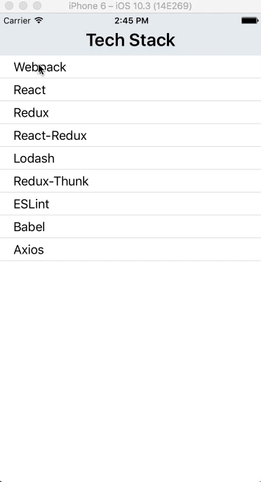

# React Native projects
> Projects based on "The Complete React Native and Redux Course" with Stephen Grider ([Link](https://www.udemy.com/the-complete-react-native-and-redux-course/learn/v4/overview))

## Albums

App that lets you scroll through a list of albums and click a link to buy them at amazon.com

The app makes HttpRequests to get the list of albums, it uses both class based components and functional components to present the data.

## Authorization

App that lets you log in and log out. If you are not a user already you can become one by simply signing in with wanted email and password. Uses firebase for authorization.

## Tech Stack

App that uses redux to store and present information about different technologies. Presents descriptions on tap using animations

## Manager

App that lets user login to manage their employees. The app uses redux and firebase as a database. The manager can add new employees, fire employees, text them their shift and edit their information.

